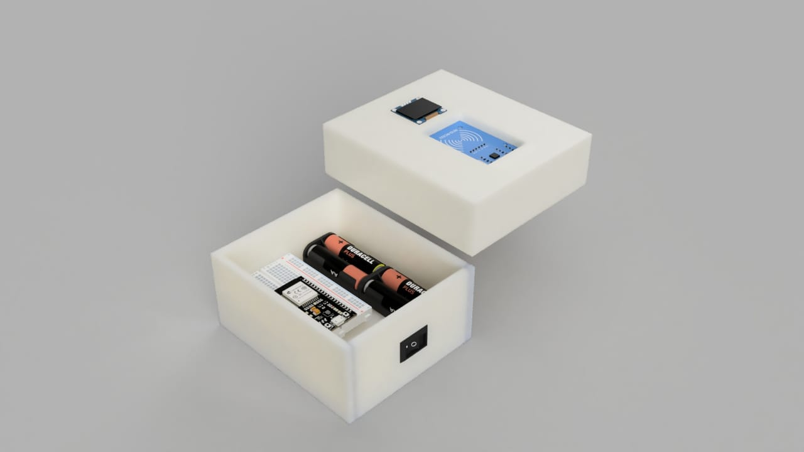
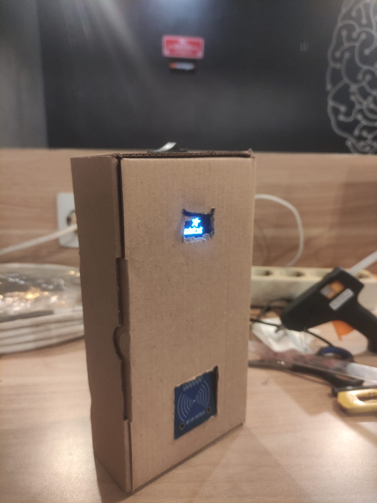
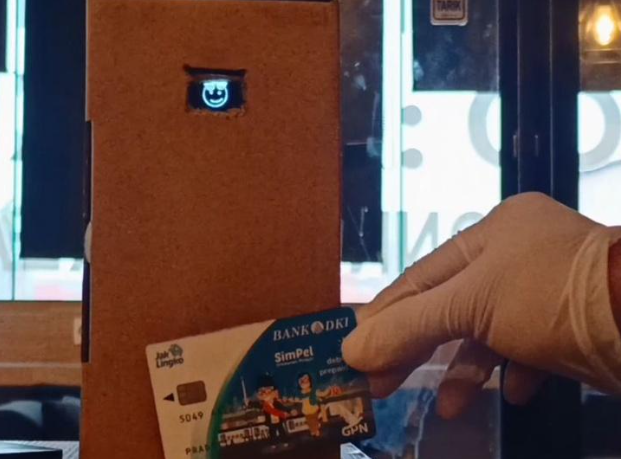

# MQTT-YOLOv5

## Overview
This repository contains a script that triggers YOLOv5 object detection upon receiving a successful MQTT message. This system is designed to ensure safety compliance by detecting the presence of necessary lab equipment when students enter a laboratory.

## Features
- **MQTT Integration**: Listens for MQTT messages to initiate YOLOv5 detection.
- **YOLOv5 Object Detection**: Ensures students are wearing lab coats, gloves, and goggles.
- **Flowchart and Product Photos**: Visual aids for understanding the system flow and components.

## System Workflow
1. **MQTT Message Received**: The script listens for MQTT messages.
2. **Run YOLOv5**: Upon receiving a success message, YOLOv5 runs object detection.
3. **Detection Result**: The results are processed and displayed.

## Flowchart
)

## Product Photo

